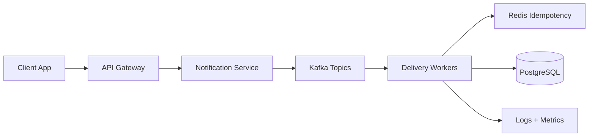
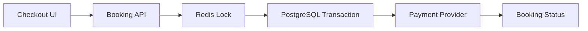
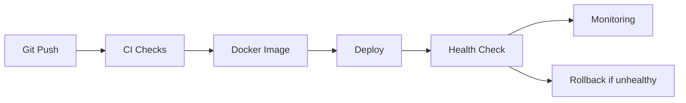

# Premium Portfolio Strategy

This document keeps deeper positioning options out of the homepage so the live portfolio stays clean, intentional, and easy to scan.

## Hero Headline Options

1. Product engineering with backend depth and cloud-ready delivery.
2. Full stack software engineer building systems users and businesses can trust.
3. I build scalable product systems across UI, APIs, data, and deployment.
4. Backend-heavy full stack engineer for reliable products and growing teams.
5. I turn product ideas into production-ready systems.
6. Full stack engineer focused on scalable architecture and clean delivery.
7. I design reliable software from frontend experience to cloud infrastructure.
8. Product-minded engineer for startups, platforms, and scalable systems.
9. I build software that is usable, observable, and ready for production.
10. Senior-minded full stack engineering for products that need to scale.

## Subheadline Options

1. I work across React interfaces, backend services, databases, CI/CD, and cloud deployment to build software that holds up after launch.
2. I combine product thinking with backend architecture, DevOps discipline, and frontend execution so teams can ship with confidence.
3. I help teams move from fragile features to maintainable systems with clear APIs, reliable data flow, and repeatable releases.
4. I build user-facing products with the system design depth needed for scale, reliability, and long-term maintainability.
5. I design software around real constraints: users, latency, data integrity, deployment risk, and team ownership.
6. I bridge product experience and infrastructure so engineering decisions support business outcomes.
7. I build full stack systems where frontend performance, backend correctness, and operational clarity work together.
8. I help startups and product teams ship faster without creating systems they cannot maintain.
9. I focus on the engineering details that users never see but businesses depend on.
10. I bring product ownership, systems thinking, and production discipline to full stack software delivery.

## CTA Options

1. Schedule Google Meet
2. Discuss a Project
3. View Engineering Work
4. Start Architecture Review
5. Talk About the Build
6. Explore Case Studies
7. Send Time Slots
8. Review My Work
9. Plan a System
10. Contact Om

## Punchline Options

1. Frontend clarity. Backend reliability. Cloud-ready delivery.
2. Product engineering with production discipline.
3. Clean interfaces backed by resilient systems.
4. Full stack execution for software that needs to last.
5. I build systems, not just screens.
6. Practical architecture for real product pressure.
7. Reliable software from idea to deployment.
8. Backend depth without losing product sense.
9. Scalable systems with clear ownership.
10. Engineering decisions tied to business outcomes.

## Trust Strip Ideas

- React UI Systems
- Spring Boot APIs
- Scalable Backends
- Docker Delivery
- CI/CD Pipelines
- Redis + Kafka
- Cloud Deployment
- Observability

Layout guidance: keep it below hero, use compact pills or equal-width tiles, and avoid logos unless they are real employers or clients.

## Diagram Patterns

### Event-Driven Backend

### Booking Consistency

### CI/CD Deployment

## Case Study Fields To Expand Later

For each production case study, expand only when a dedicated detail page exists:

- Problem statement
- Business impact
- Technical challenge
- Architecture decisions
- Scalability concerns
- Failure handling strategy
- Tech stack reasoning
- API design decisions
- Database strategy
- Caching strategy
- Deployment workflow
- Monitoring and observability
- Security considerations
- CI/CD process
- Performance optimization
- Trade-offs made
- Lessons learned
- Metrics/results

